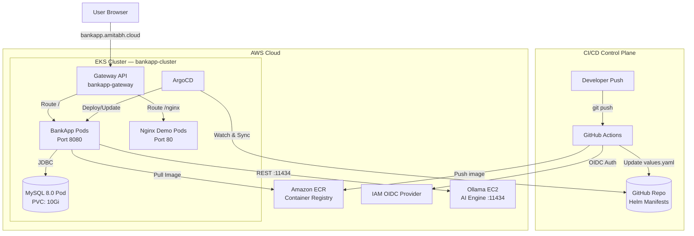

<div align="center">

# DevSecOps Banking Application

A high-performance, cloud-native financial platform built with Spring Boot 3 and Java 21. Deployed on **Amazon EKS** with a fully automated **GitOps pipeline** using GitHub Actions, ArgoCD, and Helm — enforcing **8 sequential security gates** before any code reaches production.

[](https://www.oracle.com/java/technologies/javase/jdk21-archive-downloads.html)
[](https://spring.io/projects/spring-boot)
[](.github/workflows/devsecops-main.yml)
[](#phase-4-cloud-native-deployment-eks--gitops)
[](#phase-4-cloud-native-deployment-eks--gitops)

</div>


---

## Technical Architecture

The application is deployed on a modern, cloud-native **Amazon EKS** cluster. GitHub Actions handles all CI/CD security gates, then updates Helm manifests in the repo, which **ArgoCD** automatically synchronizes to the cluster.



---

## Security Pipeline — 8 Gates

The pipeline enforces **8 sequential security gates** across three modular workflows: [`ci.yml`](.github/workflows/ci.yml), [`build.yml`](.github/workflows/build.yml), and [`cd.yml`](.github/workflows/cd.yml), all orchestrated by [`devsecops-main.yml`](.github/workflows/devsecops-main.yml).

| Gate | Job | Workflow | Tool | Behavior |
| :---: | :--- | :--- | :--- | :--- |
| 1 | `gitleaks` | `ci.yml` | Gitleaks | **Strict** — Fails if any secrets found in full Git history |
| 2 | `lint` | `ci.yml` | Checkstyle | **Audit** — Reports Java style violations (Google Style), does not block |
| 3 | `sast` | `ci.yml` | Semgrep | **Strict** — SAST on Java code (OWASP Top 10 + secrets rules) |
| 4 | `sca` | `ci.yml` | OWASP Dependency Check | **Strict** — Fails if any CVE with CVSS ≥ 7.0 found in Maven deps |
| 5 | `build` | `build.yml` | Maven | Compiles, packages JAR, uploads as build artifact |
| 6 | `image_scan` | `build.yml` | Trivy | **Strict** — Fails on CRITICAL or HIGH CVE in the Docker image |
| 7 | `push_to_ecr` | `build.yml` | Amazon ECR (OIDC) | Pushes verified image to ECR using keyless OIDC auth |
| 8 | `gitops-update` | `cd.yml` | Helm / ArgoCD | Updates `charts/bankapp/values.yaml` with new image tag → triggers ArgoCD auto-sync |

> **ArgoCD** is configured with `automated.selfHeal: true` — once `values.yaml` is updated, ArgoCD automatically pulls and deploys the new image to the EKS cluster without any manual intervention.

All scan reports (OWASP, Trivy) are uploaded as downloadable **Artifacts** in each GitHub Actions run.

---

## Technology Stack

| Category | Technology |
| :--- | :--- |
| **Backend** | Java 21, Spring Boot 3.4.1, Spring Security, Spring Data JPA |
| **Frontend** | Thymeleaf, Bootstrap |
| **AI Integration** | Ollama (TinyLlama), REST |
| **Database** | MySQL 8.0 (Kubernetes Pod) |
| **Container** | Docker (eclipse-temurin:21-jre-alpine, non-root user) |
| **Kubernetes** | Amazon EKS (cluster: `bankapp-cluster`, nodegroup: `bankapp-ng`, t3.medium) |
| **GitOps** | ArgoCD, Helm 3 |
| **Networking** | Kubernetes Gateway API (GatewayClass: `amazon-vpc-lattice`) |
| **CI/CD** | GitHub Actions (OIDC, workflow_call pattern) |
| **Security Tools** | Gitleaks, Checkstyle, Semgrep, OWASP Dependency Check, Trivy |
| **Registry** | Amazon ECR |
| **Secrets** | AWS Secrets Manager + Kubernetes Secrets |

---

## Implementation Phases

### Phase 1: AWS Infrastructure Initialization

> ### EC2 Instances Required
> | # | EC2 | Purpose | Who creates it |
> | :---: | :--- | :--- | :--- |
> | 1 | **Management EC2** | Clone repo, install tools (`eksctl`, `kubectl`, `helm`), create EKS cluster, deploy ArgoCD | You manually |
> | 2 | **Ollama EC2** | Runs Ollama AI engine (TinyLlama, port 11434) | You manually |
> | Auto | **EKS Worker Nodes** | Run BankApp, MySQL, Nginx pods | `eksctl` auto-provisions |

1. **Container Registry (ECR)**:

   - Establish a private ECR repository named `devsecops-bankapp`.

      

2. **Management EC2** *(clone repo & run all kubectl/eksctl/helm commands from here)*:

   - Deploy an **Ubuntu 22.04** EC2 instance (recommended: `t3.medium` or larger).
   - Configure Security Group to allow **Port 22** (SSH).
   - Attach an IAM Instance Profile with the following managed policies:
     - `AmazonEC2ContainerRegistryPowerUser` (ECR image push)
     - `AmazonEC2FullAccess` (VPC, subnets, security groups for eksctl)
     - `IAMFullAccess` (eksctl creates IAM roles for node groups)
     - `AWSCloudFormationFullAccess` (eksctl uses CloudFormation stacks internally)

   - Then add an **Inline Policy** named `EKSFullAccess`:
     ```json
     {
         "Version": "2012-10-17",
         "Statement": [
             {
                 "Effect": "Allow",
                 "Action": "eks:*",
                 "Resource": "*"
             }
         ]
     }
     ```

     > **Why not `AmazonEKSClusterPolicy`?** That policy is meant to be attached to the EKS cluster's own service role — it grants EKS permissions to call EC2/ELB on your behalf. It does NOT grant your EC2 permission to call EKS APIs. The inline `eks:*` policy is what actually allows the EC2 to create and manage clusters.

     > **Tip**: For simplest setup, attaching **`AdministratorAccess`** covers everything in one policy.

   - Connect via SSH and run(manually) or bootstrap using User Data:

      ```bash
      #!/bin/bash
      sudo apt update
      sudo apt install -y git curl unzip jq
      sudo snap install aws-cli --classic

      # No 'aws configure' needed — IAM Instance Profile provides credentials automatically

      # Install kubectl
      curl -LO "https://dl.k8s.io/release/$(curl -L -s https://dl.k8s.io/release/stable.txt)/bin/linux/amd64/kubectl"
      sudo install -o root -g root -m 0755 kubectl /usr/local/bin/kubectl

      # Install eksctl
      curl --silent --location "https://github.com/weaveworks/eksctl/releases/latest/download/eksctl_$(uname -s)_amd64.tar.gz" | tar xz -C /tmp
      sudo mv /tmp/eksctl /usr/local/bin

      # Install Helm
      curl https://raw.githubusercontent.com/helm/helm/main/scripts/get-helm-3 | bash
      ```

   - Verify tools:

      ```bash
      kubectl version --client && eksctl version && helm version
      ```

   - Verify IAM Instance profile working:

      ```bash
      aws sts get-caller-identity
      ```

3. **Ollama EC2** *(dedicated AI engine)*:

   - Deploy a Ubuntu EC2 instance (t3.medium) in the **Default VPC**.
   - Open Inbound Port `11434` in the Ollama Security Group.

      

   - Automate initialization using the [ollama-setup.sh](scripts/ollama-setup.sh) script via EC2 User Data.

      

   - Verify the AI engine is responsive:

     ```bash
     ollama list
     ```

      

---

### Phase 2: Security and Identity Configuration

The pipeline uses **OpenID Connect (OIDC)** for keyless authentication between GitHub Actions and AWS — no long-lived AWS keys stored anywhere.

1. **IAM Identity Provider**:
   - Provider URL: `https://token.actions.githubusercontent.com`
   - Audience: `sts.amazonaws.com`

      

2. **Deployment Role** (`GitHubActionsRole`):
   - Click on created `Identity provider` → Assign Role.
   - Enter following details:
      - `Identity provider`: Select created one.
      - `Audience`: Select one.
      - `GitHub organization`: Your GitHub username or org.
      - `GitHub repository`: `DevSecOps-Bankapp`
      - `GitHub branch`: `main`

      

   - Assign `AmazonEC2ContainerRegistryPowerUser` permissions.

      

   - Click on `Next`, Enter name of role and click on `Create role`.

      

---

### Phase 3: Secrets and Pipeline Configuration

#### 1. Kubernetes Secret (DB Password)
The Helm chart reads the MySQL password from a Kubernetes Secret named `bankapp-db-secrets`.

> This is created in **Phase 4 Step 2** after the EKS cluster and namespace exist. All other DB values (`host`, `port`, `name`, `user`) are set in `charts/bankapp/values.yaml`. **No AWS Secrets Manager needed.**

#### 2. GitHub Repository Secrets
Configure the following Action Secrets in **Settings → Secrets and variables → Actions**:

| Secret Name | Description |
| :--- | :--- |
| `AWS_ROLE_ARN` | ARN of the `GitHubActionsRole` (for OIDC) |
| `AWS_REGION` | AWS region (e.g., `us-east-1`) |
| `ECR_REPOSITORY` | ECR repo name (e.g., `devsecops-bankapp`) — used in `build.yml` for image push |
| `NVD_API_KEY` | Free API key from [nvd.nist.gov](https://nvd.nist.gov/developers/request-an-api-key) — speeds up OWASP SCA from 30+ min → ~8 min |

> **Note**: `GITHUB_TOKEN` is used automatically by `cd.yml` to commit the updated `values.yaml` — no extra PAT or `GITOPS_TOKEN` secret needed. Ensure **Settings → Actions → General → Workflow permissions** is set to **"Read and write permissions"**.

> **Note**: The `NVD_API_KEY` raises the NVD API rate limit from ~5 requests/30s to 50 requests/30s, reducing the OWASP Dependency Check scan time from 30+ minutes to under 8 minutes. Without it the SCA job will time out.


#### Obtaining the NVD API Key

**Step 1: Request the API Key**
- Go to [https://nvd.nist.gov/developers/request-an-api-key](https://nvd.nist.gov/developers/request-an-api-key).
- Enter your `Organzation name`, `email address`, and select `organization type`.
- Accept **Terms of Use** and Click **Submit**.

   

**Step 2: Activate the API Key**
- Check your email inbox for a message from `nvd-noreply@nist.gov`.

   

- Click the **activation link** in the email.
- Enter `UUID` provided in email and Enter `Email` to activate
- The link confirms your key and marks it as active.  

   

**Step 3: Get the API Key**
- After clicking the activation link, the page will generate your API key.
- Copy and save it securely.

   

**Step 4**: Add as GitHub Secret named `NVD_API_KEY`.

---

### Phase 4: Cloud-Native Deployment (EKS & GitOps + TLS)

> **Prerequisites**: All tools (`kubectl`, `eksctl`, `helm`) were already installed on the Management EC2 in Phase 1 via User Data. SSH into it, clone the repo, and continue:

> ```bash
> git clone https://github.com/Amitabh-DevOps/DevSecOps-Bankapp.git
> cd DevSecOps-Bankapp
> ```

#### Step 1 — Create EKS Cluster

Run the automated setup script. It uses **`--vpc-from-lookup-default`** to create the cluster inside your **Default VPC**, ensuring it shares the same network space as Ollama.

```bash
chmod +x scripts/eks-setup.sh
./scripts/eks-setup.sh
```

> **Note**: This setup takes ~15-20 minutes.

Verify nodes are ready:

```bash
kubectl get nodes
```

#### Step 2 — Update Ollama Security Group

> **⚠️ Networking is Now Simple**: Since EKS and Ollama are now in the **Same VPC (Default)**, you don't need peering or complex CIDRs. Just go to **EC2 → Security Groups**, find the **Ollama EC2's security group**, and add an inbound rule: 
> - **Port**: `11434`
> - **Protocol**: `TCP`
> - **Source**: **`eks-cluster-sg-bankapp-cluster-...`** (Find the Security Group applied to your EKS nodes). 
> 
> This allows the BankApp pods to talk to Ollama using its **Private IP** (`192.168.19.40`) without any restrictions.

#### Step 3 — Create Namespace & DB Secret

```bash
kubectl create namespace bankapp-prod

kubectl create secret generic bankapp-db-secrets \
  --from-literal=password=<YOUR_DB_PASSWORD> \
  -n bankapp-prod
```

#### Step 4 — Install Envoy Gateway

Envoy Gateway is the industry-standard implementation of the Gateway API. It will automatically provision an AWS Network Load Balancer (NLB) for your cluster.

```bash
# 1. Install standard Gateway API CRDs (required)
kubectl apply -f https://github.com/kubernetes-sigs/gateway-api/releases/download/v1.1.0/standard-install.yaml

# Install Envoy Gateway via Helm
helm install eg oci://docker.io/envoyproxy/gateway-helm --version v1.1.0 -n envoy-gateway-system --create-namespace

# 3. Wait for the control plane to be ready
kubectl wait -n envoy-gateway-system \
  deployment/envoy-gateway \
  --for=condition=Available --timeout=5m
```

> **Note**: Envoy Gateway will manage the "Envoy Proxy" pods that handle the actual traffic to your BankApp.

#### Step 5 — Install cert-manager (Let's Encrypt TLS)

Cert-manager manages your TLS certificates. We must enable the **GatewayAPI** feature gate so it can talk to Envoy.

```bash
# 1. Add Jetstack Helm repo
helm repo add jetstack https://charts.jetstack.io
helm repo update

# 2. Install cert-manager with Gateway API enabled
helm install cert-manager jetstack/cert-manager \
  --namespace cert-manager \
  --create-namespace \
  --version v1.17.1 \
  --set crds.enabled=true \
  --set "config.enableGatewayAPI=true"

# 3. Verify cert-manager pods are running
kubectl get pods -n cert-manager
```

> **Note**: cert-manager will automatically provision and renew the TLS certificate for `bankapp.amitabh.cloud` via Let's Encrypt HTTP01 challenge. The certificate is stored as a Kubernetes Secret (`bankapp-tls-secret`) and referenced by the Gateway.

> Before applying, update `charts/bankapp/templates/certificate.yaml` line `email:` with your real email address for Let's Encrypt expiry notifications.

#### Step 5 — Install ArgoCD

```bash
kubectl create namespace argocd
kubectl apply -n argocd -f https://raw.githubusercontent.com/argoproj/argo-cd/stable/manifests/install.yaml

# Wait for pods to be ready
kubectl get pods -n argocd --watch
```

#### Step 6 — Expose & Login to ArgoCD

```bash
# Expose ArgoCD UI via LoadBalancer
kubectl patch svc argocd-server -n argocd -p '{"spec": {"type": "LoadBalancer"}}'

# Get the ArgoCD LoadBalancer URL (wait ~2 mins for it to provision)
kubectl get svc argocd-server -n argocd

# Get initial admin password
kubectl -n argocd get secret argocd-initial-admin-secret \
  -o jsonpath="{.data.password}" | base64 -d && echo
```

Open the ArgoCD LB URL in a browser → Login with:
- **Username**: `admin`
- **Password**: output of the command above

#### Step 7 — Deploy via ArgoCD (Apply Manifest)

```bash
kubectl apply -f gitops/argocd-app.yaml
```

ArgoCD will sync `charts/bankapp` from the `main` branch and deploy all resources: Deployments, Services, PVC, Gateway, HTTPRoutes, and cert-manager Certificate.

Verify in ArgoCD UI that the app appears and starts syncing. Get the Gateway LoadBalancer address for DNS:

```bash
kubectl get svc -n bankapp-prod
# or
kubectl get gateway bankapp-gateway -n bankapp-prod
```

#### Step 8 — Configure DNS

Once the Gateway/LoadBalancer address is available, go to your DNS provider (`amitabh.cloud`) and create:

| Type | Name | Value |
| :--- | :--- | :--- |
| A / CNAME | `bankapp` | `<Gateway LoadBalancer IP or Hostname>` |

> DNS propagation takes 1-5 minutes. Once done, Let's Encrypt will automatically provision the TLS certificate via HTTP01 challenge.

#### Step 9 — Trigger the GitOps Pipeline

Push code to the `main` branch. GitHub Actions will:
1. Run 8 security gates (Gitleaks → Checkstyle → Semgrep → OWASP DC → Build → Trivy → ECR Push → GitOps Update).
2. Gate 8 commits the new `image.tag` to `charts/bankapp/values.yaml`.
3. ArgoCD detects the change on `main` and **auto-syncs** the updated image to the EKS cluster.

**Access:**
- `https://bankapp.amitabh.cloud/` → BankApp (TLS via Let's Encrypt)
- `https://bankapp.amitabh.cloud/nginx` → Nginx demo
- HTTP → HTTPS 301 redirect is handled by the Gateway automatically

---

## Helm Chart Structure

```
charts/bankapp/
├── Chart.yaml              # Chart metadata (name: bankapp, version: 0.1.0)
├── values.yaml             # All configurable values (domain, image, DB, Nginx)
└── templates/
    ├── _helpers.tpl        # Shared template helpers
    ├── deployment.yaml     # BankApp Deployment (ECR image, health probes)
    ├── service.yaml        # BankApp ClusterIP Service (port 8080)
    ├── mysql.yaml          # MySQL 8.0 Deployment + ClusterIP Service
    ├── nginx.yaml          # Nginx Demo Deployment + Service (conditional)
    ├── gateway.yaml        # Gateway API — Gateway resource (port 80)
    └── httproute.yaml      # Gateway API — HTTPRoute (domain + path routing)
```

**Path Routing:**
| Path | Backend | Description |
| :--- | :--- | :--- |
| `your-domain.com/` | BankApp (port 8080) | Spring Boot Banking Application |
| `your-domain.com/nginx` | Nginx (port 80) | Demo service to showcase Gateway API routing |

**ArgoCD Application** (`gitops/argocd-app.yaml`):
- Points to `charts/bankapp` in this repo.
- Deploys to namespace: `bankapp-prod`.
- Auto-sync enabled with `prune: true` and `selfHeal: true`.

---

## CI/CD Pipeline Overview

```
git push
    │
    ▼
CI Workflow (ci.yml)
    ├── Gate 1: Gitleaks      ── Secret scan (full history)
    ├── Gate 2: Checkstyle    ── Java style audit
    ├── Gate 3: Semgrep       ── SAST (OWASP Top 10)
    └── Gate 4: OWASP DC      ── Dependency CVE scan
    │
    ▼ (on success)
Build Workflow (build.yml)
    ├── Gate 5: Maven Build   ── Compile + package JAR
    ├── Gate 6: Trivy Scan    ── Container image scan
    └── Gate 7: ECR Push      ── Push image (OIDC auth)
    │
    ▼ (on success)
CD Workflow (cd.yml)
    └── Gate 8: GitOps Update ── Update values.yaml → commit → push
    │
    ▼ (ArgoCD auto-sync)
EKS Cluster
    └── ArgoCD syncs new image tag → Rolling update on BankApp pods
```

---

## Operational Verification

| Check | Command |
| :--- | :--- |
| Node status | `kubectl get nodes` |
| Pod status | `kubectl get pods -n bankapp-prod` |
| ArgoCD sync status | `kubectl get applications -n argocd` |
| Gateway status | `kubectl get gateway -n bankapp-prod` |
| Routes | `kubectl get httproute -n bankapp-prod` |

**Access:**
- **BankApp**: `http://bankapp.yourdomain.com/`
- **Nginx Demo**: `http://bankapp.yourdomain.com/nginx`
- **ArgoCD UI**: `http://<argocd-loadbalancer-ip>` (user: `admin`)

**DB Verification:**

```bash
kubectl exec -it <mysql-pod-name> -n bankapp-prod -- mysql -u bankuser -p bankapp -e "SELECT * FROM accounts;"
```

**Ollama Connectivity:**

```bash
nc -zv <OLLAMA-PRIVATE-IP> 11434
```

---

<div align="center">

Happy Learning

**TrainWithShubham**

</div>