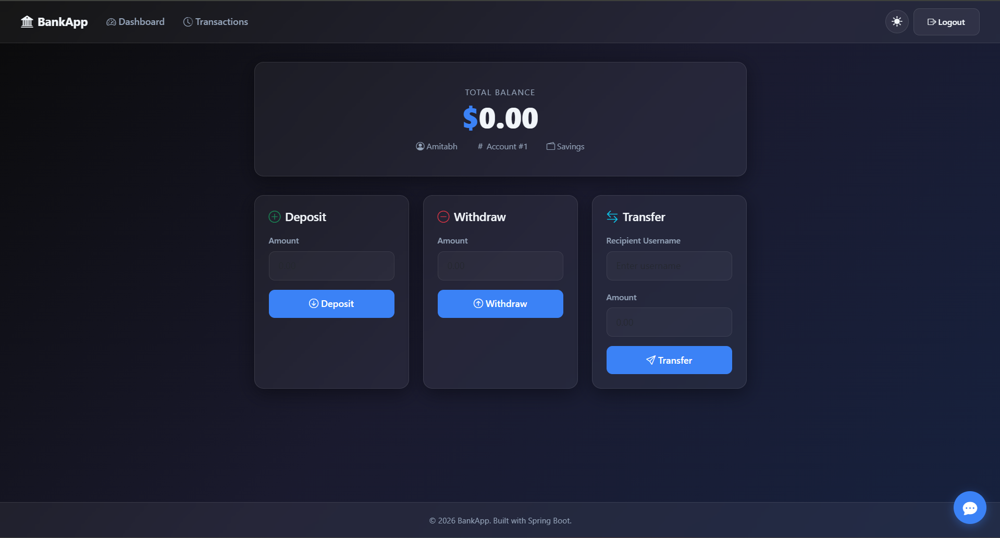
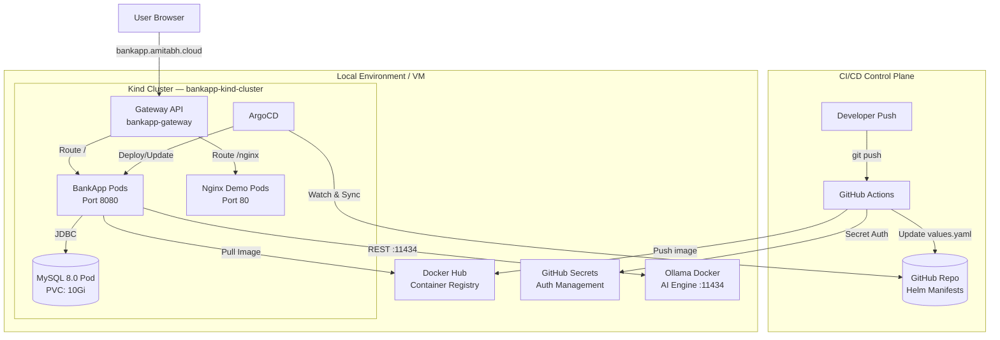
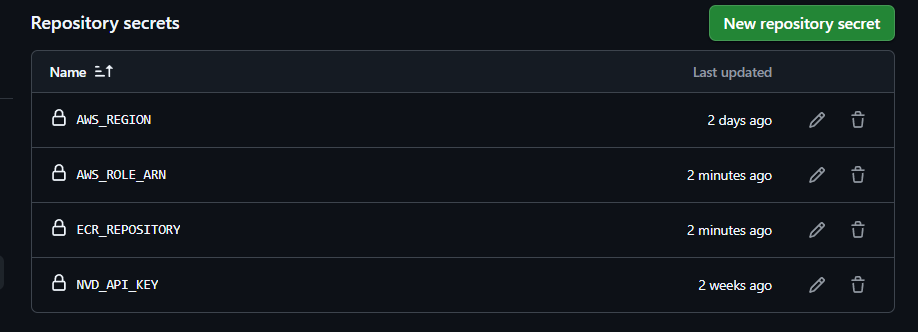
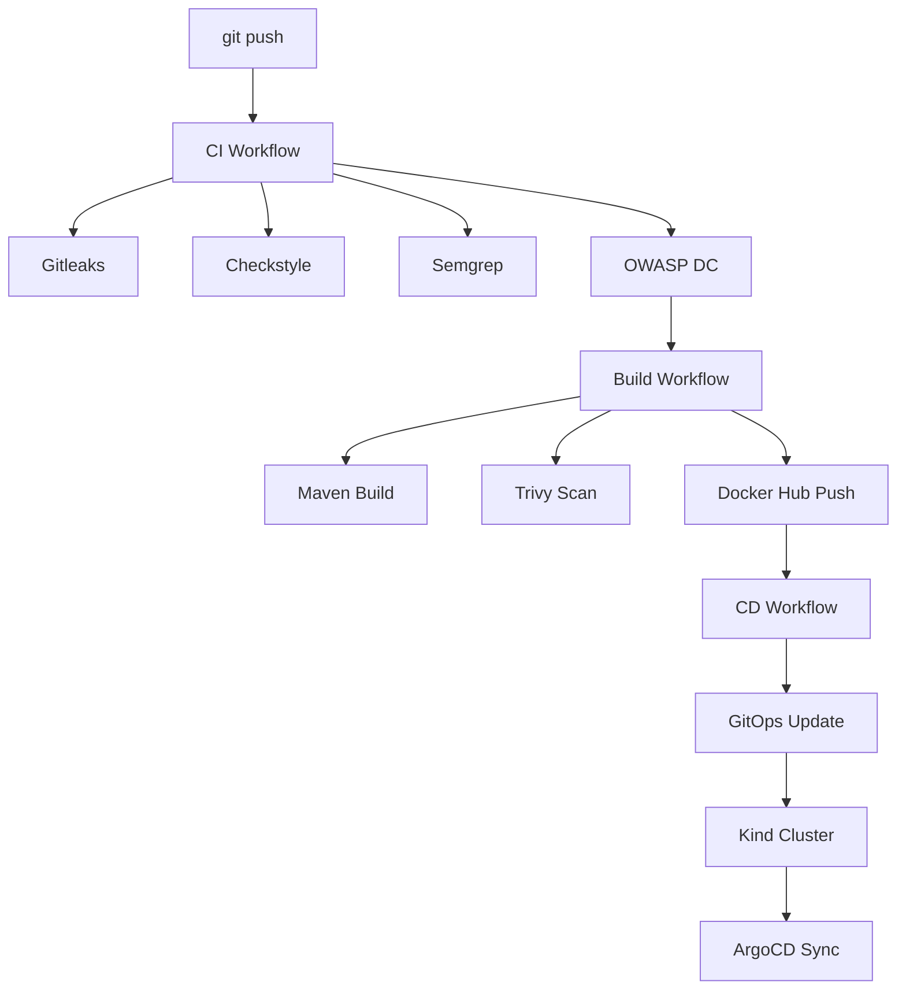
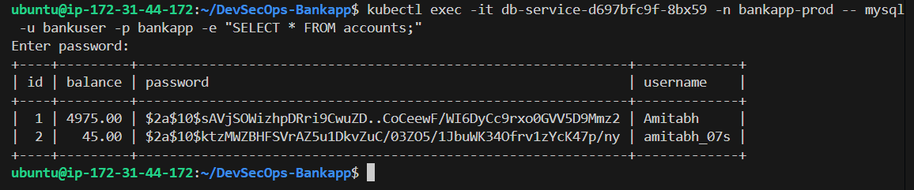

<div align="center">

# DevSecOps Banking Application

A high-performance, cloud-native financial platform built with Spring Boot 3 and Java 21. Deployed on **Kind (Kubernetes in Docker)** with a fully automated **GitOps pipeline** using GitHub Actions, ArgoCD, and Helm — enforcing **8 sequential security gates** before any code reaches production.

[](https://www.oracle.com/java/technologies/javase/jdk21-archive-downloads.html)
[](https://spring.io/projects/spring-boot)
[](.github/workflows/devsecops-main.yml)
[](#phase-3-cloud-native-deployment-gitops--tls)
[](#phase-3-cloud-native-deployment-gitops--tls)

</div>



---

## Technical Architecture

The application is deployed on a modern, cloud-native **Kind** cluster. GitHub Actions handles all CI/CD security gates, then updates Helm manifests in the repo, which **ArgoCD** automatically synchronizes to the cluster.



---

## Security Pipeline — 8 Gates

The pipeline enforces **8 sequential security gates** across three modular workflows: [`ci.yml`](.github/workflows/ci.yml), [`build.yml`](.github/workflows/build.yml), and [`cd.yml`](.github/workflows/cd.yml), all orchestrated by [`devsecops-main.yml`](.github/workflows/devsecops-main.yml).

| Gate | Job | Workflow | Tool | Behavior |
| :---: | :--- | :--- | :--- | :--- |
| 1 | `gitleaks` | `ci.yml` | Gitleaks | **Strict** — Fails if any secrets found in full Git history |
| 2 | `lint` | `ci.yml` | Checkstyle | **Audit** — Reports Java style violations (Google Style), does not block |
| 3 | `sast` | `ci.yml` | Semgrep | **Strict** — SAST on Java code (OWASP Top 10 + secrets rules) |
| 4 | `sca` | `ci.yml` | OWASP Dependency Check | **Strict** — Fails if any CVE with CVSS ≥ 7.0 found in Maven deps |
| 5 | `build` | `build.yml` | Maven | Compiles, packages JAR, uploads as build artifact |
| 6 | `image_scan` | `build.yml` | Trivy | **Strict** — Fails on CRITICAL or HIGH CVE in the Docker image |
| 7 | `push_to_dockerhub` | `build.yml` | Docker Hub (Secrets) | Pushes verified image to Docker Hub using secure secrets |
| 8 | `gitops-update` | `cd.yml` | Helm / ArgoCD | Updates `charts/bankapp/values.yaml` with new image tag → triggers ArgoCD auto-sync |

> **ArgoCD** is configured with `automated.selfHeal: true` — once `values.yaml` is updated, ArgoCD automatically pulls and deploys the new image to the Kind cluster without any manual intervention.

All scan reports (OWASP, Trivy) are uploaded as downloadable **Artifacts** in each GitHub Actions run.

---

## Technology Stack

| Category | Technology |
| :--- | :--- |
| **Backend** | Java 21, Spring Boot 3.4.1, Spring Security, Spring Data JPA |
| **Frontend** | Thymeleaf, Bootstrap |
| **AI Integration** | Ollama (TinyLlama), REST |
| **Database** | MySQL 8.0 (Kubernetes Pod) |
| **Container** | Docker (eclipse-temurin:21-jre-alpine, non-root user) |
| **Kubernetes** | Kind (Kubernetes in Docker) |
| **GitOps** | ArgoCD, Helm 3 |
| **Networking** | Kubernetes Gateway API (GatewayClass: `envoy`) |
| **CI/CD** | GitHub Actions (Standard Workflow) |
| **Security Tools** | Gitleaks, Checkstyle, Semgrep, OWASP Dependency Check, Trivy |
| **Registry** | Docker Hub |
| **Secrets** | Kubernetes Secrets, GitHub Actions Secrets |

---

## Implementation Phases

### Phase 1: Local Infrastructure Initialization (Kind)

> ### Environment Requirements
> | # | Component | Purpose | How to create it |
> | :---: | :--- | :--- | :--- |
> | 1 | **EC2 (Ubuntu)**| Host Instance | Launch `t3.medium` (Ubuntu 24.04) |
> | 2 | **Docker** | Container Runtime | Install via `apt` |
> | 3 | **Kind** | Local Kubernetes Cluster | Install via binary |
> | 4 | **Ollama** | Runs Ollama AI engine | Run as Docker container |
> | 5 | **kubectl/Helm** | Cluster management | Install binaries |

#### Step 0 — EC2 Launch & Docker Setup

1. **Launch Instance**: 
   - AMI: **Ubuntu Server 24.04 LTS**.
   - Type: **t3.medium** (Min 2 vCPU, 4GB RAM).
   - Security Group: Allow **80 (HTTP)**, **443 (HTTPS)**, and **8081 (ArgoCD)**.

2. **Update & Install Docker**:
   ```bash
   sudo apt update && sudo apt upgrade -y
   
   # Install Docker
   sudo apt install docker.io -y
   sudo usermod -aG docker $USER && newgrp docker
   ```

#### Step 1 — Infrastructure Initialization (Kind)
   - Install Kind:
   
      ```bash
      curl -Lo ./kind https://kind.sigs.k8s.io/dl/v0.22.0/kind-linux-amd64 
      chmod +x ./kind
      sudo mv ./kind /usr/local/bin/kind
      ```

   - Run the automated setup script:

     ```bash
     chmod +x scripts/kind-setup.sh
     ./scripts/kind-setup.sh
     ```

   - This script creates a cluster with port mappings (80/443) and installs Envoy Gateway + ArgoCD.

2. **Ollama Setup (Docker)**:
   - Run Ollama locally:
   
     ```bash
     docker run -d -v ollama:/root/.ollama -p 11434:11434 --name ollama ollama/ollama
     docker exec -it ollama ollama run tinyllama
     ```

---

### Phase 2: Security and Pipeline Configuration

#### 1. Docker Hub Repository
- Create a repository named `devsecops-bankapp` on [hub.docker.com](https://hub.docker.com/).

#### 2. GitHub Repository Secrets
Configure the following Action Secrets in **Settings → Secrets and variables → Actions**:

| Secret Name | Description |
| :--- | :--- |
| `DOCKERHUB_USERNAME` | Your Docker Hub username |
| `DOCKERHUB_TOKEN` | Your Docker Hub Personal Access Token (PAT) |
| `DOCKERHUB_REPO` | Your full repo name (e.g., `username/devsecops-bankapp`) |
| `NVD_API_KEY` | Free API key from [nvd.nist.gov](https://nvd.nist.gov/developers/request-an-api-key) |

> **Note**: `GITHUB_TOKEN` is used automatically by `cd.yml` to commit the updated `values.yaml` — ensure **Settings → Actions → General → Workflow permissions** is set to **"Read and write permissions"**.

#### Obtaining the NVD API Key (Optional but Recommended)
The `NVD_API_KEY` raises the NVD API rate limit from ~5 requests/30s to 50 requests/30s, reducing the OWASP Dependency Check scan time from 30+ minutes to under 8 minutes. Without it the SCA job will time out.

**Step 1: Request the API Key**
- Go to [https://nvd.nist.gov/developers/request-an-api-key](https://nvd.nist.gov/developers/request-an-api-key).
- Enter your `Organzation name`, `email address`, and select `organization type`.
- Accept **Terms of Use** and Click **Submit**.

   

**Step 2: Activate the API Key**
- Check your email inbox for a message from `nvd-noreply@nist.gov`.

   

- Click the **activation link** in the email.
- Enter `UUID` provided in email and Enter `Email` to activate
- The link confirms your key and marks it as active.  

   

**Step 3: Get the API Key**
- After clicking the activation link, the page will generate your API key.
- Copy and save it securely.

   

**Step 4**: Add as GitHub Secret named `NVD_API_KEY`.
   
   

#### 3. Kubernetes Secret (DB Password)
The Helm chart reads the MySQL password from a Kubernetes Secret named `bankapp-db-secrets`.

> This is created in **Phase 3 Step 2** after the Kind cluster and namespace exist.

---

### Phase 3: Cloud-Native Deployment (GitOps + TLS)

#### Step 1 — Create Namespace & DB Secret

```bash
kubectl create namespace bankapp-prod

kubectl create secret generic bankapp-db-secrets \
  --from-literal=password=<YOUR_DB_PASSWORD> \
  -n bankapp-prod
```

#### Step 2 — Install cert-manager (Let's Encrypt TLS)

```bash
# 1. Add Jetstack Helm repo
helm repo add jetstack https://charts.jetstack.io
helm repo update

# 2. Install cert-manager
helm install cert-manager jetstack/cert-manager \
  -n cert-manager --create-namespace \
  --version v1.17.1 \
  --set installCRDs=true \
  --set "config.enableGatewayAPI=true"

# 3. Wait for readiness
kubectl wait --for=condition=Available deployment \
  -l app.kubernetes.io/instance=cert-manager \
  -n cert-manager --timeout=5m

# 4. Verify
kubectl get pods -n cert-manager
kubectl get crds | grep cert-manager
```

> **Note**: cert-manager will automatically provision and renew the TLS certificate for `bankapp.amitabh.cloud` via Let's Encrypt HTTP01 challenge. The certificate is stored as a Kubernetes Secret (`bankapp-tls-secret`) and referenced by the Gateway.

> Before applying, update `charts/bankapp/templates/certificate.yaml` line `email:` with your real email address for Let's Encrypt expiry notifications.

#### Step 3 — Login to ArgoCD

The setup script displays the initial admin password. Login to the ArgoCD UI (Exposed via standard Kubernetes service):

```bash
# Access ArgoCD UI (if not exposed, use port-forward)
kubectl port-forward svc/argocd-server -n argocd 8081:443
```
Login via `https://localhost:8081` with user `admin`.

#### Step 4 — Deploy via ArgoCD (Apply Manifest)

```bash
kubectl apply -f gitops/argocd-app.yaml
```

ArgoCD will sync `charts/bankapp` and deploy all resources.

#### Step 5 — Simulated LoadBalancer (Kind Patch)

In Kind, the `LoadBalancer` service stays "Pending" since there is no cloud provider. Run this to patch it with your local IP:

```bash
# 1. Identify the Envoy service
export ENVOY_SVC=$(kubectl get svc -n envoy-gateway-system -l gateway.envoyproxy.io/own-gateway-name=bankapp-gateway -o name)

# 2. Patch it with 127.0.0.1 (Localhost)
kubectl patch $ENVOY_SVC -n envoy-gateway-system --type='merge' -p '{"status": {"loadBalancer": {"ingress": [{"ip": "127.0.0.1"}]}}}'
```

#### Step 6 — Configure DNS

Once patched, your Gateway will show `127.0.0.1` as the address. Go to your DNS provider (`amitabh.cloud`) and create:

| Type | Name | Value |
| :--- | :--- | :--- |
| A Record | `bankapp` | `127.0.0.1` (or your machine's Public IP) |

> **Note**: For Let's Encrypt to verify your domain, you **must** use your Public IP and ensure port **80** is forwarded to your machine.

#### Step 7 — Trigger the GitOps Pipeline

Push code to `main`. GitHub Actions will:
1. Run 8 security gates.
2. Gate 8 commits the new tag to `values.yaml`.
3. ArgoCD auto-syncs the new image to the Kind cluster.

---

## Technical Overview



---

## Verification & Access

| Check | Command |
| :--- | :--- |
| Cluster Nodes | `kubectl get nodes` |
| Application Pods | `kubectl get pods -n bankapp-prod` |
| ArgoCD Apps | `kubectl get applications -n argocd` |
| Gateway Status | `kubectl get gateway -n bankapp-prod` |
| HTTP Routes | `kubectl get httproute -n bankapp-prod` |

**Access Points:**
*   **BankApp**: `https://bankapp.amitabh.cloud/`
*   **Nginx Demo**: `https://bankapp.amitabh.cloud/nginx`
*   **ArgoCD UI**: `https://localhost:8081` (via `kubectl port-forward`)

---

## Helm Chart Structure

```
charts/bankapp/
├── Chart.yaml              # Chart metadata (name: bankapp, version: 0.1.0)
├── values.yaml             # All configurable values (domain, image, DB, Nginx)
└── templates/
    ├── _helpers.tpl        # Shared template helpers
    ├── certificate.yaml    # cert-manager Certificate & Issuer
    ├── deployment.yaml     # BankApp Deployment (Docker Hub image, health probes)
    ├── gateway.yaml        # Gateway API — Gateway resource (port 443 + TLS)
    ├── gatewayclass.yaml   # Envoy Gateway Class definition
    ├── httproute.yaml      # Gateway API — HTTPRoute (domain + path routing)
    ├── mysql.yaml          # MySQL 8.0 Deployment + ClusterIP Service
    ├── nginx.yaml          # Nginx Demo Deployment + Service (conditional)
    └── service.yaml        # BankApp ClusterIP Service (port 8080)
```

**Path Routing:**
| Path | Backend | Description |
| :--- | :--- | :--- |
| `your-domain.com/` | BankApp (port 8080) | Spring Boot Banking Application |
| `your-domain.com/nginx` | Nginx (port 80) | Demo service to showcase Gateway API routing |

**ArgoCD Application** (`gitops/argocd-app.yaml`):
- Points to `charts/bankapp` in this repo.
- Deploys to namespace: `bankapp-prod`.
- Auto-sync enabled with `prune: true` and `selfHeal: true`.

---

## CI/CD Pipeline Overview

```
git push
    │
    ▼
CI Workflow (ci.yml)
    ├── Gate 1: Gitleaks      ── Secret scan (full history)
    ├── Gate 2: Checkstyle    ── Java style audit
    ├── Gate 3: Semgrep       ── SAST (OWASP Top 10)
    └── Gate 4: OWASP DC      ── Dependency CVE scan
    │
    ▼ (on success)
Build Workflow (build.yml)
    ├── Gate 5: Maven Build   ── Compile + package JAR
    ├── Gate 6: Trivy Scan    ── Container image scan
    └── Gate 7: Docker Hub Push── Push image (Secret auth)
    │
    ▼ (on success)
CD Workflow (cd.yml)
    └── Gate 8: GitOps Update ── Update values.yaml → commit → push
    │
    ▼ (ArgoCD auto-sync)
Kind Cluster
    └── ArgoCD syncs new image tag → Rolling update on BankApp pods
```

---

## DB Verification

```bash
kubectl exec -it <mysql-pod-name> -n bankapp-prod -- mysql -u bankuser -p bankapp -e "SELECT * FROM accounts;"
```



---

## 🧹 Cleanup

To delete the local infrastructure:

1. **Delete Kind Cluster**:
   ```bash
   kind delete cluster --name bankapp-kind-cluster
   ```

2. **Delete Ollama Container**:
   ```bash
   docker stop ollama && docker rm ollama
   ```


---

<div align="center">

Happy Learning

**TrainWithShubham**

</div>